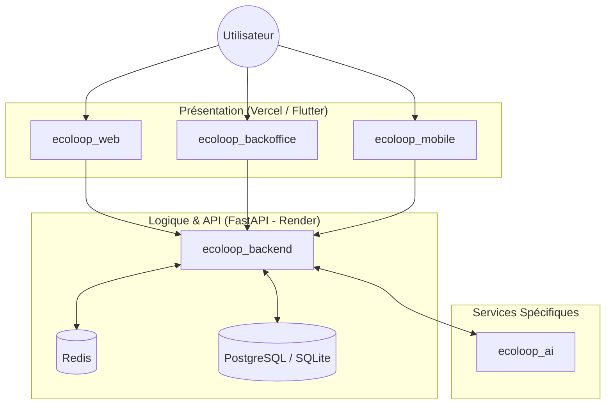

# EcoLoop AI — Moteur d'Économie Circulaire & Marketplace Déchets


> L'Intelligence Artificielle et la Traçabilité Blockchain/Ledger au service de l'Économie Circulaire. Conçu pour le **VIBEATHON 2026**.

## 🌍 Vision
EcoLoop réinvente la valorisation des déchets urbains en Côte d'Ivoire et dans les métropoles africaines en connectant de manière transparente les ménages producteurs, les chauffeurs collecteurs informels et les entreprises de recyclage (industriels) via une marketplace décentralisée et traçable.

---

## 🚨 Problèmes & Solution V3.4
- **Risque Réglementaire Éliminé** : Pas de portefeuille bancaire virtuel risqué. Utilisation d'un système d'**EcoPoints** traçables convertibles en Mobile Money avec des clés d'idempotence strictes contre la fraude.
- **Asymétrie de Prix** : Tarification transparente basée sur des règles globales (`pricing_rules`) ou des offres d'achat directes (`purchase_offers`), gelées sous forme de snapshots lors des transactions.
- **Confiance Mutuelle** : Trois scores de fiabilité distincts mis à jour dynamiquement pour sanctionner les comportements abusifs (poids falsifié, retards, non-paiements).
- **Matching & Logistique** : Missions de collecte planifiées avec ordre de passage et géolocalisation pour maximiser la rentabilité des collecteurs.

---

## 🏗️ Architecture du Projet



---

## 📁 Structure du Monorepo

- **`ecoloop_backend`** : API REST FastAPI (Python 3.12) gérant les comptes d'EcoPoints, les calculs de transactions idempotents, les litiges, et la base de données (SQLAlchemy 2.0 / Alembic).
- **`ecoloop_web`** : Application web client React + TypeScript pour les producteurs (Ménages) : publication des lots, acceptation des offres d'achat, suivi des EcoPoints.
- **`ecoloop_backoffice`** : Interface d'administration pour les arbitres administratifs (`ADMIN_ARBITER`) et les industriels (soumission d'offres, validation de la qualité des lots reçus).
- **`ecoloop_mobile`** : Application mobile Flutter pour les collecteurs (Chauffeurs) : navigation GPS, missions assignées, et preuves physiques de collecte.
- **`ecoloop_ai`** : Microservice de classification d'images (YOLO/MobileNet), prédiction de prix (Prophet), et détection de fraude transactionnelle.

---

## 🧠 Fonctionnalités Clés V3.4

### 1. Ledger d'EcoPoints Sécurisé
- Calcul des soldes via un livre comptable immuable (`eco_point_transactions`) pour éliminer tout risque d'incohérence financière.
- Retrait Mobile Money sécurisé par clé d'idempotence pour empêcher le double retrait en cas de coupure réseau.

### 2. Triples Scores de Fiabilité Dynamiques
- **Seller Reliability Score** : Mis à jour par les notations des recycleurs sur la qualité réelle déclarée du lot.
- **Collector Reliability Score** : Mis à jour selon le respect des horaires et des trajets.
- **Buyer Reliability Score** : Mesure le délai moyen de paiement des entreprises.
- *Boost Débutant* : Les nouveaux chauffeurs bénéficient d'un score de réputation temporairement verrouillé à `1.0` pendant leurs 5 premières collectes.

### 3. Gestion Logistique par Missions
- Regroupement des lots de déchets acceptés dans des missions logistiques complexes (`collection_missions`) avec séquence de passage optimale pour les chauffeurs.

### 4. Arbitrage & Litiges (Disputes)
- En cas de désaccord sur le poids ou le type de matériau à la réception par le recycleur, un litige est ouvert. Les EcoPoints correspondants sont immédiatement **verrouillés (`LOCKED`)** en attendant l'arbitrage d'un administrateur certifié (`ADMIN_ARBITER`).

---

## 🚀 Installation & Lancement Local

### Prérequis
- **Python 3.12+**
- **Node.js 18+**
- **Flutter 3.40+**

### 1. Démarrer l'API Backend
```bash
cd ecoloop_backend
python -m venv venv
source venv/bin/activate  # Sur Windows: venv\Scripts\activate
pip install -r requirements.txt
cp .env.example .env
# Appliquer les migrations
alembic upgrade head
# Démarrer le serveur
python -m uvicorn main:app --reload --port 8000
```

### 2. Lancer l'Application Web Client (Ménages)
```bash
cd ecoloop_web
npm install
npm run dev
```

### 3. Lancer le Backoffice (Admin & Industriels)
```bash
cd ecoloop_backoffice
npm install
npm run dev
```

### 4. Lancer l'Application Mobile (Flutter)
```bash
cd ecoloop_mobile
flutter pub get
flutter run
```

### 5. Lancer les Tests (Backend)
```bash
cd ecoloop_backend
pytest
```
