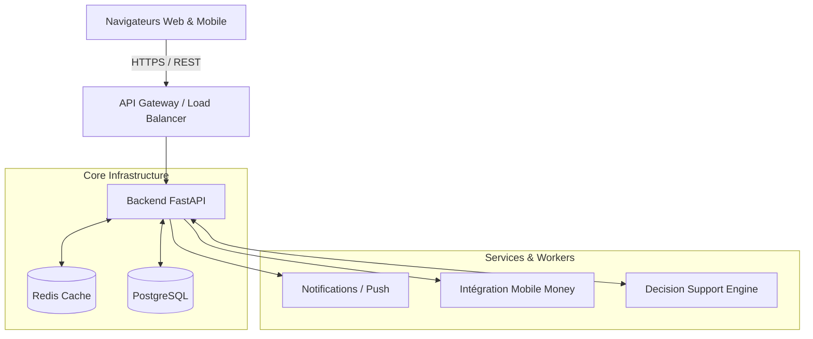

# Architecture EcoLoop

L'architecture d'EcoLoop a été pensée pour répondre à des enjeux de **scalabilité**, de **séparation des responsabilités (Separation of Concerns)** et de **maintenance à long terme**. 

## Vue d'ensemble

## Pourquoi ce choix technologique ?

### 1. Frontend : React + TypeScript + Vite
- **Modulaire** : L'interface est découpée par "features" (Producteur, Collecteur, Mairie, Industriel).
- **TypeScript** : Typage strict pour éviter les erreurs lors de la manipulation des objets complexes (Lots, Contrats).
- **Performances** : Vite offre un temps de build extrêmement rapide et une expérience développeur optimale.

### 2. Backend : FastAPI (Python)
- **Asynchrone par nature** : Permet de gérer un nombre important de requêtes I/O (appels IA, requêtes base de données) sans bloquer les workers.
- **Intégration Data/IA** : Python est le langage standard pour l'Intelligence Artificielle. Le même langage est utilisé pour l'API et le Moteur de prédiction, réduisant la friction.
- **Validation** : Intégration native de Pydantic assurant que toutes les données entrantes et sortantes sont strictement conformes aux schémas métiers.

### 3. Base de données : PostgreSQL
- **Robuste** : Schéma relationnel fort garantissant l'intégrité des transactions (qui paie qui, traçabilité des lots).
- **Extensible** : Capacité à intégrer PostGIS à terme pour des calculs de géolocalisation spatiale ultra-performants.

### 4. Cache : Redis
- Utilisé pour mettre en cache les requêtes coûteuses des tableaux de bord analytiques (Mairie, Industriel), allégeant la base de données.

## Stratégie de Déploiement & Scalabilité
Nous avons conçu l'architecture pour être facilement provisionnée sur le cloud :
- Le Frontend (statique) est déployé sur un réseau CDN global (Edge network) pour une latence minimale.
- Le Backend est "Stateless" (sans état), ce qui permet de le scaler horizontalement derrière un Load Balancer.
- La logique métier est découplée des routes HTTP (pattern Services), facilitant l'évolution vers une architecture de micro-services si le produit nécessite d'isoler le moteur IA du reste de l'application.
